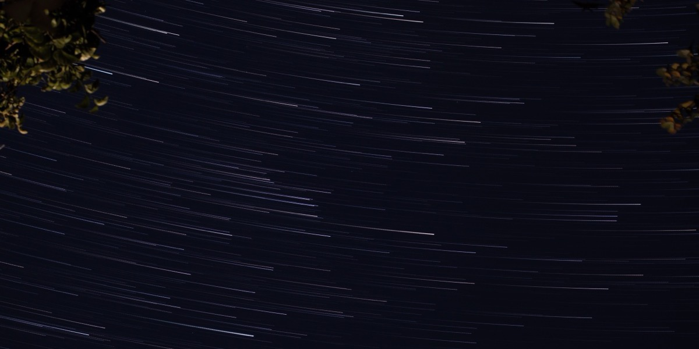

# [Star Trails](https://javier.xyz/startrails)

Stack a folder of timelapse frames into a single star trail photo, in the
browser.

[](https://javier.xyz/startrails)

## How it works

Every frame is composited onto the same canvas with a `lighten` blend, which
keeps the brightest pixel it has seen at each position. Stars move between
exposures, so each one paints a line while the landscape underneath stays put.

Stacking at full opacity gives every star an even streak that starts and stops
abruptly, so each frame is instead drawn at `position^power` of full opacity,
where position runs from 0 at the first frame to 1 at the last. Early frames
land faint and later ones land solid, which fades every trail in behind a bright
head. **Min opacity** puts a floor under that curve so the oldest frames still
register.

| Parameter     | Default | What it does                                                     |
| ------------- | ------- | ---------------------------------------------------------------- |
| `power`       | `2`     | Falloff curve. 1 is linear; higher values sharpen the trail head. |
| `min opacity` | `0`     | Floor for the opacity curve, as a percentage.                     |
| frame range   | all     | First and last frame of the sequence to stack.                    |

For best results use 20 to 40 second exposures and keep the interval between
shots as short as the camera allows.

## Frame order

Frames are stacked in filename order, the way the folder reads in Finder: digit
runs compare as numbers, so `shot2.jpg` lands before `shot10.jpg` rather than
after `shot12.jpg`. This matters because opacity is applied by position in the
sequence, so a scrambled order produces a scrambled stack.

Zero-padded camera filenames (`DSCF1888.jpg`, `IMG_0123.jpg`) sort identically
either way. Unpadded ones do not, which is where the command line version, using
a plain `readdirSync().sort()`, would disagree.

## Video input

A single `.mp4`, `.mov`, `.m4v` or `.webm` can be dropped in instead of a folder,
for material that was already rendered to a clip. The video is stepped frame by
frame by seeking a hidden `<video>` element, and each sampled frame is encoded to
a JPEG in memory. From that point on it uses the same preview, range handles and
export as a folder of stills.

Frames are sampled evenly across the whole clip, up to a cap of 600. A 20 second
clip at 30fps therefore yields every one of its 600 frames, while a 60 second one
yields every third. The frame rate is measured from the video rather than assumed,
and the app reports what it sampled. There is no control for it: below the cap
every frame is used, and above it the only choice left is which ones to drop.

Two consequences are worth knowing. The frames are re-encoded, so a video source
goes through JPEG once more than a folder does. This is barely visible on footage
that is already h.264, but it is not lossless. Extracted frames carry no metadata,
so the EXIF option does not appear for a video.

Extraction is one seek and one JPEG encode per frame, and the two are pipelined
across a pair of canvases, so a frame encodes while the next one is being seeked
to. That is most of the cost, and it roughly halves it.

## The sample clip

`public/example-startrail.mp4` is loaded by the page itself, a moment after first
paint, and stacked like any other video. It replaces the gallery of finished
stacks that used to sit here: the interesting part of this tool is what power,
min opacity and the range handles do, and a still cannot show that. Opening a
folder or a video at any point aborts the sample and takes over, including during
the download.

Its first frame is saved as a lightweight preview, so the page has a real image
and disabled controls from the first paint. Download, extraction and frame-cache
progress appear over that image; later source changes keep the last completed
stack visible until its replacement is ready. Once the sample is ready, its
frame range sweeps from the saved first frame to the complete stack.

It is 2.8 seconds at 1080 × 1620, deliberately re-encoded down to 2.5 MB, since
the download is the slowest part of arriving on the page. Stacked side by side
with the 6.9 MB original the two differ by 0.6% mean, which is nothing on a night
sky.

## Everything runs locally

There is no server and no upload. Frames are decoded and composited by a Web
Worker on your own machine, which is what makes a folder of several hundred
full-resolution frames practical.

Two passes do the work. Opening a folder decodes every frame once at a reduced
size into a cache sized to fit a fixed memory budget. Long sequences get a
smaller preview, but no frames are sampled out. Every frame must
have the same aspect ratio. The preview's longest displayed side is at most 640
CSS pixels, with an exactly 2x backing bitmap for Retina displays, and it is
capped again at 60% of the viewport height so a portrait sequence cannot push
the controls off the bottom of the screen. Changing
power, min opacity or the range then re-stacks in milliseconds. Export makes a
second pass at full resolution, decoding a couple of frames at a time and
releasing each one as soon as it is drawn, so peak memory stays at the output
canvas plus the frames in flight rather than the whole sequence.

## EXIF

Canvas encoders drop all metadata, so the export lifts the APP segments out of
the first frame's bytes and splices them into the finished JPEG: camera, lens,
date, shooting settings, XMP and the ICC profile all carry over, and the result
files alongside the frames it came from.

Three things are corrected on the way through. Orientation is reset to 1,
because the frames were already rotated when they were decoded. The pixel
dimensions are updated to the real output size. The embedded thumbnail is
dropped, so no viewer previews a single unstacked frame. As with the command
line version, the exposure tags describe the first frame, not the stack.

## Opening a folder

Chromium browsers get a real directory handle: the folder is remembered between
visits, and **Rescan** re-reads it so frames shot since show up. Browsers cannot
watch a folder for changes on their own yet. The File System Observer origin
trial ended at Chrome 134, so refreshing is a button rather than automatic.

Safari and Firefox fall back to a folder upload or drag-and-drop, which reads
the same frames but cannot be rescanned.

## Development

```sh
pnpm install
pnpm dev
```

Then open http://localhost:3009/startrails.

`pnpm build` produces the static export in `out/`, which the Deploy workflow
publishes to the `gh-pages` branch.

One constraint worth knowing: `src/workers/stack.worker.js` must not import
anything. Under `output: 'export'` Turbopack copies it into `_next/static/media`
verbatim instead of bundling it, so an import would survive into the emitted
file as a bare specifier and 404 at runtime.

## Command line version

`cli/` holds the original command line tool, which does the same thing over a
folder on disk using node-canvas and exiftool. It keeps its own `package.json`
so the web app's install never pulls a native module:

```sh
cd cli
pnpm install
node star-trails.js --src=/path/to/frames
```

| Parameter       | Default                                       | What it does                                                  |
| --------------- | --------------------------------------------- | ------------------------------------------------------------- |
| `--src`         | required                                      | Folder of frames.                                             |
| `--power`       | `2`                                           | Falloff curve. Higher sharpens the trail head.                 |
| `--min-opacity` | `0`                                           | Floor for the opacity curve, 0-100.                            |
| `--first`       | first frame                                   | Start from this filename, inclusive.                           |
| `--last`        | last frame                                    | Stop at this filename, inclusive.                              |
| `--out`         | `./out/[first]-[last]-p[power][-mo[min]].jpg` | Output path.                                                   |
| `--exif`        | off                                           | Copy metadata from the first frame. Needs `exiftool` on PATH. |

Two differences from the web tool, both in `--exif`, which shells out to
`exiftool -TagsFromFile` and copies the source tags verbatim. The output keeps
the source's `Orientation`, even though node-canvas already rotated the pixels,
so an oriented sequence exports sideways; and it keeps the source's pixel
dimensions and embedded thumbnail, which describe one unstacked frame. The web
tool corrects all three.

## License

BSD-3-Clause
